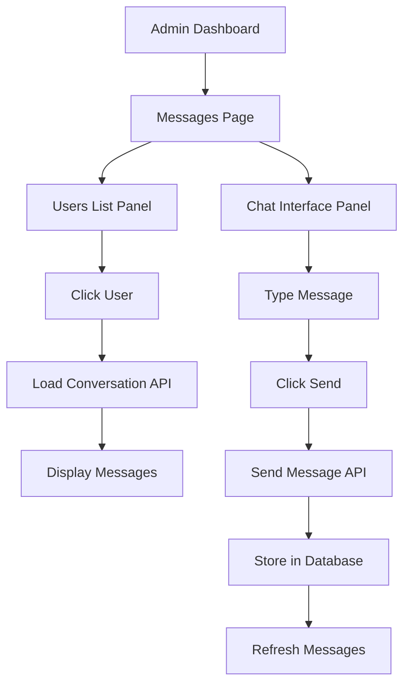
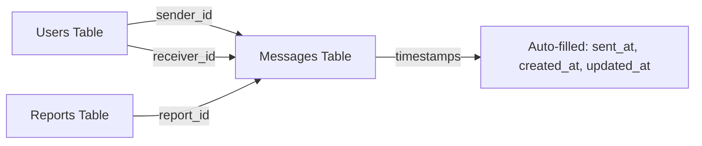
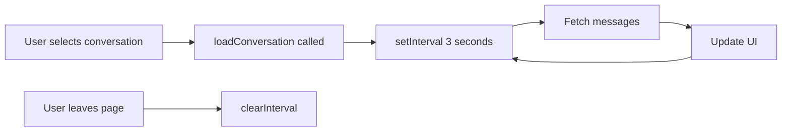
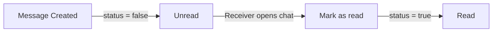

# Messaging System Flow Diagram

## System Architecture



## Database Relationships



## Message Flow

```mermaid
graph TD
    A[User selects recipient] --> B[Click user in list]
    B --> C[AJAX: GET /messages/conversation/userId]
    C --> D[MessageController@getConversation]
    D --> E[Query messages from DB]
    E --> F[Mark messages as read]
    F --> G[Return JSON response]
    G --> H[Display messages in chat]
    
    I[User types message] --> J[Submit form]
    J --> K[AJAX: POST /messages/send]
    K --> L[MessageController@sendMessage]
    L --> M[Validate input]
    M --> N[Store message in DB]
    N --> O[Return success response]
    O --> P[Refresh conversation]
    P --> C
```

## UI Components Structure

```
┌─────────────────────────────────────────────────────────┐
│                    Messages Page                        │
├──────────────────┬──────────────────────────────────────┤
│   Users List     │         Chat Interface               │
│                  │                                      │
│  ┌────────────┐  │  ┌─────────────────────────────┐   │
│  │ User 1     │  │  │  Chat Header: Selected User │   │
│  │ Full Name  │  │  └─────────────────────────────┘   │
│  │ Email      │  │                                      │
│  └────────────┘  │  ┌─────────────────────────────┐   │
│                  │  │                               │   │
│  ┌────────────┐  │  │   Message Bubbles             │   │
│  │ User 2     │  │  │   (Scrollable)                │   │
│  │ Full Name  │  │  │                               │   │
│  │ Email      │  │  │   [Received Message]          │   │
│  └────────────┘  │  │        [Sent Message]         │   │
│                  │  │   [Received Message]          │   │
│  (Scrollable)    │  │                               │   │
│                  │  └─────────────────────────────┘   │
│                  │                                      │
│                  │  ┌─────────────────────────────┐   │
│                  │  │  [Message Input]            │   │
│                  │  │  [Send Button]              │   │
│                  │  └─────────────────────────────┘   │
└──────────────────┴──────────────────────────────────────┘
```

## API Endpoints

### 1. GET /messages
- **Purpose:** Display the main messages page
- **Controller:** MessageController@index
- **Returns:** View with list of all users

### 2. GET /messages/conversation/{userId}
- **Purpose:** Fetch conversation between admin and specific user
- **Controller:** MessageController@getConversation
- **Parameters:** userId (URL parameter)
- **Returns:** JSON with array of messages
- **Side Effect:** Marks messages as read

### 3. POST /messages/send
- **Purpose:** Send a new message
- **Controller:** MessageController@sendMessage
- **Request Body:**
  ```json
  {
    "receiver_id": 123,
    "message": "Message content"
  }
  ```
- **Returns:** JSON with created message object

### 4. GET /messages/unread-count
- **Purpose:** Get count of unread messages for current user
- **Controller:** MessageController@getUnreadCount
- **Returns:** JSON with unread count

## Data Flow Example

### Sending a Message:

1. **User Action:**
   - Admin types message in textarea
   - Clicks "Send" button or presses Enter

2. **Frontend (JavaScript):**
   ```javascript
   sendMessage(event) {
     - Prevent form submission
     - Get message text
     - Disable send button
     - Make AJAX POST request
     - Handle response
     - Clear input
     - Reload conversation
     - Re-enable send button
   }
   ```

3. **Backend (Laravel):**
   ```php
   sendMessage(Request $request) {
     - Validate input
     - Create message record
     - Set sender_id = auth()->id()
     - Set receiver_id from request
     - Set sent_at = now()
     - Set status = false
     - Save to database
     - Return JSON response
   }
   ```

4. **Database:**
   ```sql
   INSERT INTO messages (
     sender_id,
     receiver_id,
     message,
     status,
     sent_at,
     created_at,
     updated_at
   ) VALUES (...)
   ```

5. **Response:**
   - Frontend receives success
   - Refreshes conversation
   - Displays new message

## Auto-Refresh Mechanism



## Message States



## Security Measures

1. **CSRF Protection:** All POST requests include CSRF token
2. **Authentication:** All routes protected by auth middleware
3. **Authorization:** Users can only send messages as themselves
4. **Input Validation:** Server-side validation of all inputs
5. **XSS Prevention:** HTML escaping in frontend display
6. **SQL Injection Prevention:** Laravel Eloquent ORM with parameter binding

## Performance Optimizations

1. **Eager Loading:** Messages loaded with sender/receiver relationships
2. **Efficient Queries:** Indexed foreign keys for fast lookups
3. **Auto-scroll:** Only when new messages are added
4. **Debouncing:** Input events optimized
5. **Conditional Rendering:** Empty states vs. message lists
